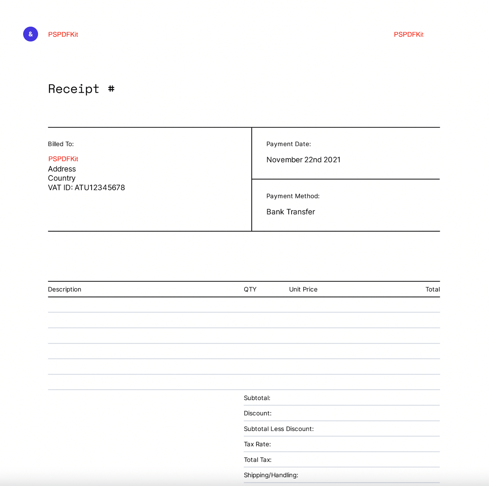

## Generate PDFs from a Template Using JavaScript

<center>
  <a href="https://pspdfkit.com/pdf-sdk/web/viewer/">
    
  </a>
</center>

## Prerequisites

- [Node.js](http://nodejs.org/) (with npm or Yarn)

## Getting Started

This repository is an example of how to generate PDFs from a PDF template.

In order to make the PSPDFKit for Web's library available for building, we have to copy the `pspdfkit-lib/` directory from `node_modules/pspdfkit/dist/` into the `assets` directory. This is done in the package.json `postinstall` script.

```bash
npm install # install dependencies

npm run postinstall
```

## Running the Example

We are ready to launch the app! 🎉

1. Install the serve package:

```bash
npm install --global serve
```

2. Serve the contents of the current directory:

```bash
serve -l 8080 .
```

3. Navigate to `http://localhost:8080` to view the website.

To learn more about this feature, make sure to read the accompanying [guide](https://pspdfkit.com/guides/web/pdf-generation/from-template/).

## Contributing

Please ensure
[you have signed our CLA](https://pspdfkit.com/guides/web/current/miscellaneous/contributing/) so that we can
accept your contributions.
